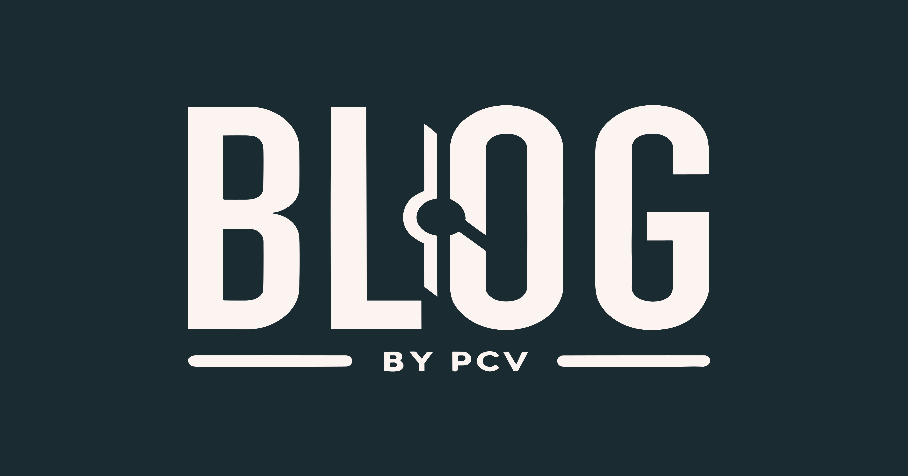

# Personal Blog by Petar Cvetko Voćanec 📄

  

  
  &nbsp;&nbsp;&nbsp;
  
  &nbsp;&nbsp;&nbsp;
  

    

Fast and lightweight personal blog built with [Astro](https://astro.build/) and [TailwindCSS](https://tailwindcss.com/) hosted on [AWS](https://aws.amazon.com/) using S3 and CloudFront.

Production site is available at [blog.petar-cv.com](https://blog.petar-cv.com/).

Light ☀️ and dark 🌙 mode are supported by default.

## 🚀 Project Structure

Any static assets, like images, can be placed in the `public/` directory.

All blog posts are stored in `src/content/blog` directory in markdown format.

## 💻 Tech Stack

**Main Framework** - [Astro](https://astro.build/)  
**Type Checking** - [TypeScript](https://www.typescriptlang.org/)  
**Styling** - [TailwindCSS](https://tailwindcss.com/)  
**Deployment** - [AWS](https://aws.amazon.com/)  
**Code Formatting** - [Prettier](https://prettier.io/)  
**Linting** - [ESLint](https://eslint.org)

## 🧞 Commands

All commands are run from the root of the project, from a terminal:

| Command                  | Action                                       |
| :----------------------- | :------------------------------------------- |
| `npm install`            | Installs dependencies                        |
| `npm run dev`            | Starts local dev server at `localhost:4321`  |
| `npm run build`          | Build your production site to `./dist/`      |
| `npm run preview`        | Preview your build locally, before deploying |
| `npm run prettier:check` | Check code format with Prettier              |
| `npm run prettier:write` | Format codes with Prettier                   |
| `npm run prepare`        | Set up the husky hooks                       |
| `npm run unlighthouse`   | Runs Unlighthouse with local config          |

## 📜 License

Licensed under the BSD 3-Clause License, Copyright © 2023

## 🧑‍🤝‍🧑 Contributing

Made with ❤️ by [Petar Cvetko Voćanec](https://github.com/Petar-CV) and [contributors](https://github.com/Petar-CV/personal-blog/graphs/contributors).
