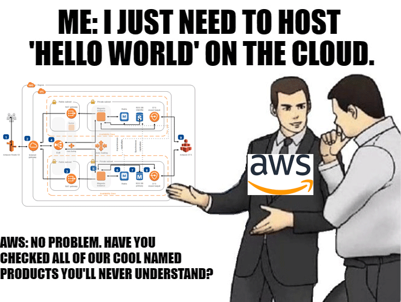

### Deployment to AWS

So we've built the blog and now we have to ship it to the users. Two methods come to my mind; we can either ship our PC to customers or deploy it to some platform. With the first one, we can be sure that we avoided the _it works on my machine_ problem, but the second one seems more enticing 😆.

What services are we going to use? Let's look at Astro's deployment docs and would you look at that, they even have a whole section about [hosting on AWS](https://docs.astro.build/en/guides/deploy/aws/). Since it's easier to spend 5 hours debugging than reading the docs for 5 minutes, I went on to try the first option without much investigation, which is [AWS Amplify](https://aws.amazon.com/amplify/). And oh boy was I in for a treat. Spoiler alert: _it wasn't nice_.


_Meme gracefully stolen from [Reddit](https://www.reddit.com/r/ProgrammerHumor/comments/9ym7mj/aws_in_a_nutshell/)_

#### War with AWS Amplify

My newbie's brain found itself on an AWS service that it's heard about. As the main service title says **"Build full-stack web and mobile apps in hours. Easy to start, easy to scale"**... Unless you're building apps that require a Node version higher than 18.13.0. More on that a bit later.

So AWS Amplify it is. A bit of an oversight on my part was that AWS Amplify is best suited for classic three-layer web app architecture with backend and frontend constantly talking to each other. That means that AWS Amplify uses EC2 instances which are technically not needed and much more expensive than S3 storage which we should use for static content. But my newbie brain didn't know any better. Not for the next 5 hours, that is.

Starting with Amplify is easy enough. You just head over to the AWS Amplify service overview while you're logged in and click on a big shiny button to create a new project. After your project is created, you'll be asked to choose from where you want your code to be taken from. I've chosen GitHub and given permission to a specific project. After that, I was asked if the build settings (that are automatically detected for supported frameworks) were configured right. I only had to change the build output directory. Our app doesn't have a backend service nor it requires environment variables so our configuration was done and the project was created.

> Keep in mind that we've got a really simple example on our hands. AWS Amplify offers various other features such as using CLI to help you build apps from your favorite IDE's shell or even using a UI editor on their website.

Smooth sailing so far. How about some problems for the sailor?
Next was the deployment step aaand my first build failed. Okay, hardly anything works on the first try in the development world. What was the issue? Astro 3.x.x requires node 18.17.x to run properly. A quick Google search yields results on how to set custom node version for containers that are building and running our code inside the AWS Amplify service. Since Amplify's default amazonlinux2 image uses [NVM](https://github.com/nvm-sh/nvm), they allow us to easily customize the current node version inside the build settings of our project. After changing that node version to the latest 18.18.2 node (at the time of writing, node 20 was available as LTS as well), I tried the deployment process again aaaand it failed again. What now? The output read as follows:

```
# Starting phase: preBuild
2023-11-01T18:15:08.707Z [INFO]: # Executing command: npm ci
2023-11-01T18:15:08.708Z [WARNING]: node: /lib64/libm.so.6: version `GLIBC_2.27' not found (required by node)
                                    node: /lib64/libc.so.6: version `GLIBC_2.28' not found (required by node)
2023-11-01T18:15:08.709Z [ERROR]: !!! Build failed
2023-11-01T18:15:08.709Z [ERROR]: !!! Non-Zero Exit Code detected
2023-11-01T18:15:08.709Z [INFO]: # Starting environment caching...
2023-11-01T18:15:08.709Z [INFO]: # Environment caching completed
Terminating logging...
```

A really strange error. But I've seen these types of errors when trying to run the latest node versions on outdated VPSes. Google offered me a couple of links that suggested I should build my own image that'll be run instead of amazonlinux2. I'll spare you the details, but after 3-4 hours of trial and error development, I gave up. I've tried various things such as using multiple official node images from ECR, building custom steps to set up those node images, etc. I didn't want to run some unofficial node image that was being suggested to me by the community (sorry guys, but I don't trust people who offer me candy). The last thing I did was upvote the issue on the official AWS Amplify [hosting repository](https://github.com/aws-amplify/amplify-hosting/issues/3773). As of 4th November 2023, this issue is still active and people are not happy. I went to sleep.

### The winning formula

The next day I woke up and thought about Astro's deployment docs. As I've spent about 5 hours debugging AWS Amplify, I thought I could give it a try to read the documentation again. And would you look at that; Astro has a section on [hosting static site on S3](https://docs.astro.build/en/guides/deploy/aws/#s3-static-website-hosting). Since I found a new inspiration and felt pretty good, I did something previously unthinkable; I scrolled further into docs 😱. The section that caught my eye was [hosting with CloudFront and S3](https://docs.astro.build/en/guides/deploy/aws/#s3-with-cloudfront).

Jokes aside, I highly encourage you to take a look at the section on hosting with CloudFront and S3. I modified that process a bit to suit my needs.

So far, the winning formula includes:

- AWS CodeBuild
- AWS CodePipeline
- AWS S3
- AWS CloudFront

### Setting up S3 bucket

Head over to [S3 console](https://s3.console.aws.amazon.com/s3/get-started) and continue to create a new bucket.
Choose your bucket name and leave everything as default.

Don't let the _Static website hosting_ section fool you. That option is useful only when you're hosting stuff directly from S3 storage. But we're going to use CloudFront to host stuff from the S3 storage. Since AWS made this process pretty straightforward, we can create a bucket policy so our CloudFront instance has direct access to the S3. Don't worry about that for now, we'll touch on that a bit later.

### Setting up CodePipeline and CodeBuild

I wanted to have continuous integration and deployment (CI/CD) using AWS CodeBuild and CodePipeline. Setting up these services was pretty easy.

Head over to [CodePipeline](https://aws.amazon.com/codepipeline/) and select your region of choice. I followed the following steps to create a pipeline.

- Upon clicking the button for creating a new pipeline, you'll be asked to name your pipeline. Everything else is left as default.
- In step 2, I've chosen _GitHub (Version 2)_ and connected my repository. Under the "Repository name" you should choose your repo. Furthermore, I've selected the _Push in a branch_ option under the "Pipeline trigger" section, and in the "Branch name" I've inputted "production" since I want my build to automatically start when I push something on that branch. If you don't see your branch available, head over to your GitHub repository and manually create the branch.
- In step 3, you need to choose AWS CodeBuild as your build provider and then click the button that says "Create project". This will open up a window on which you'll be able to quickly create a CodeBuild project. I left everything as default and continued. Keep in mind that you'll need to have the `buildspec.yaml` file at the root of your project. Here's how that file looks in my case.

```yaml
version: 0.2

phases:
  install:
    runtime-versions:
      nodejs: 18

  pre_build:
    commands:
      - npm ci

  build:
    commands:
      - npm run build

artifacts:
  files:
    - '**/*'
  base-directory: 'dist'
```

- Next was the deploy step and over there I ticked the _Extract file before deploy_ checkbox and continued.
- Review your pipeline and create it.

In a nutshell, CodePipeline grabs the latest code from your repository (GitHub in my case) and sends it to CodeBuild. I've specified that only changes on _production_ branch get taken by the CodePipeline. CodeBuild follows the `buildspec.yaml` files that you're asked to provide (I did it by committing the file to the root directory of my project). CodePipeline then takes those files to the S3 storage which is used by the CloudFront service to provide it _on the edge_.

### Setting up CloudFront

Head over to the [CloudFront](https://aws.amazon.com/cloudfront/) page and start creating a distribution.

- For the _Origin_ you'll need to choose your previously created S3 bucket.
- On the _Origin access_ choose the _Origin access control settings (recommended)_ option. You'll be asked to choose the control setting. If you don't have one, you can click the button to create just that. A new dialog will pop up and on that, you can leave everything as default, just make sure the _Origin type_ is S3.
- Scroll a bit further until you find the _Viewer protocol policy_ option and select _HTTPS only_.
- For the _Cache policy_, _CatchingOptimized_ should be selected.
- For the _Origin request policy - optional_ you should select the _AllViewerExceptHostHeader_ option.
- I turned off the Web Application Firewall for now.
- The SSL certificate will be covered a bit later (in the next blog post) since my use case was a bit different.

When the distribution is created successfully, there are a couple of things that you'd like to set up.
Firstly, you should set up the error pages inside the distribution. So head over to the _Error pages_ tab and click the _Create custom error response_ button. On the _HTTP error code_ select _403: Forbidden_ and click _Yes_ to customize the error response. In my case, _Response page path_ is set to _/404.html_ while the _HTTP Response code_ option is set to _200: OK_.
Repeat the same process for the _404: Not found_ error code.
This is done so the visitor gets redirected to the 404 page from within our Astro blog when the 403 or 404 errors happen. These could occur when the visitor tries to go to the nonexistent page or tries to access some forbidden resource.

Last but not least, if you're someone who actually reads the docs, chances are you've stumbled across the following guide on using [CloudFront with Astro](https://docs.astro.build/en/guides/deploy/aws/#cloudfront-functions-setup). In a nutshell, CloudFront doesn't support multi-page routing by default, so one solid solution is to create a CloudFront function to point the request to the desired object in S3.

```javascript
function handler(event) {
  var request = event.request;
  var uri = request.uri;

  // Check whether the URI is missing a file name.
  if (uri.endsWith('/')) {
    request.uri += 'index.html';
  }
  // Check whether the URI is missing a file extension.
  else if (!uri.includes('.')) {
    request.uri += '/index.html';
  }

  return request;
}
```

Take the code snippet above and head over to the CloudFront console. On the sidebar, you can find the _Functions_ link. On that page, you'll find the button for creating a new function.

- Choose a name and continue.
- On the next step, past the copied function code and click the _Save changes_ button.
- After that, go to the _Publish_ tab and click _Publish function_.
- After that's done, you'll be able to find the _Associated distributions_ table a bit further down the page.
- Click on the button to add a new associated distribution and a dialog will open.
- Select the CloudFront distribution you've previously created.
- On the _Cache behavior_ choose the _Default_ option and add association.

### Docs and posts I found useful

- [Tutorial: Create a pipeline that uses Amazon S3 as a deployment provider](https://docs.aws.amazon.com/codepipeline/latest/userguide/tutorials-s3deploy.html#tutorials-s3deploy-s3source)
- [AWS S3, Static Site, CloudFront, Route53, Namecheap: How to host your website with domain](https://medium.com/@maksymyurchak/aws-s3-react-spa-cloudfront-route53-namecheap-how-to-host-your-website-with-domain-8e01c16187fc)
- [How do I serve index.html in subfolders with S3/Cloudfront?](https://stackoverflow.com/a/76581267)
- [Amazon Web Services In Plain English](https://expeditedsecurity.com/aws-in-plain-english/)

### Conclusion

In a nutshell, I'm really satisfied with the way everything works as expected even to an AWS newbie like myself. I still remember how I played with CI/CD a little bit over a year ago while trying to build a custom Docker and Jenkins pipeline for deploying my web app in Angular and NestJS. There was always something that came up a bit later. Oh, you forgot to set up automatic cleaning of unused Docker images? Too bad, I'm gonna take all your VPS's disk space. Oh, you didn't set up automatic redeploy in case of an error. Good luck next time.
Although I know some DevOps guys will laugh at the problems I've had with custom VPS deployment, I for one, don't want to spend multiple days to properly set up and document the deployment process for my client. And don't get me started on the education part. I've seen a couple of really badly outdated VPSes that host production apps and probably have various vulnerabilities just because some full-stack developer told his boss "Sure, I can deploy this app." and then proceeded to set up everything with default credentials as a root user while not having UFW setup. Oh well...


What's missing is the HTTPS certificate for our website. Stay tuned for a post on how to use AWS Route 53 with a domain from Namecheap.

Happy coding! 🐛
