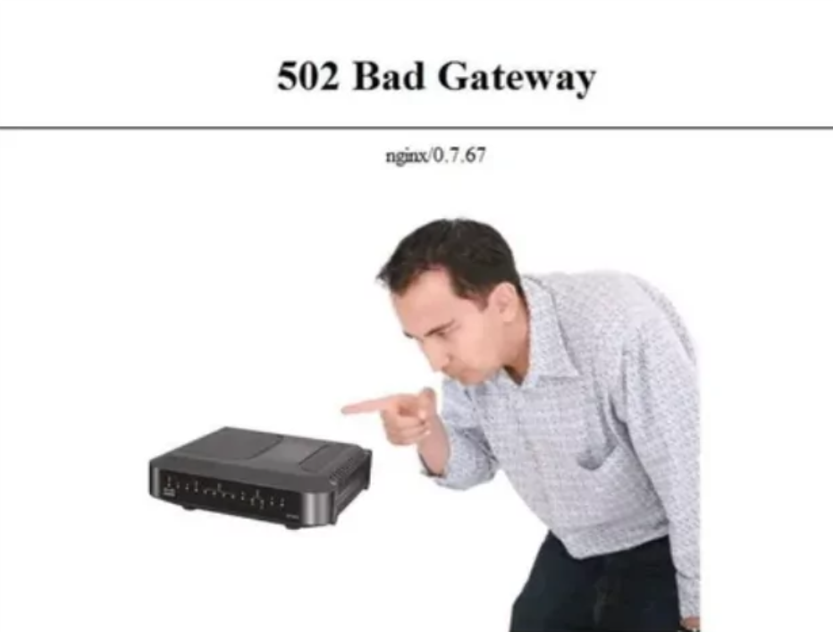

### HTTPS certificate for our blog

To avoid seeing the ugly _Your connection is not private_ message blasted across the whole screen upon entering our blog, we'll set up an HTTPS certificate.

When I played around with my VPS which I loved to host on [Hetzner](https://www.hetzner.com/), I used a nice little tool called [Certbot](https://certbot.eff.org/) to automatically issue HTTPS certificates for my root domain and all the subdomains that I've pointed to that VPS. And it was a pretty nice and straightforward process, to say the least. Although it's worth noting that I've only played with Ubuntu servers not older than the 18.04 version.

Buuut since we're doing everything using the new hip & cool serverless methods of hosting our applications, we _should_ use something appropriate for the task at hand. Here comes the Route 53.

### Namecheap and Route 53

[AWS Route 53](https://aws.amazon.com/route53/) is a highly available and scalable Domain Name System (DNS) web service.

[Namecheap](https://www.namecheap.com/) is an ICANN-accredited domain name registrar and web hosting company. I bought a couple of domains using their service and the experience was good so far. Everything was relatively easy to set up and some edge cases were found on the internet. Are there better options? Probably. I'll look into them when my main domain expires.

Sooo since I have my domain bought outside of AWS I don't want to transfer the domain to AWS since I have a couple of other projects that need migrating as well. What now?

First and foremost, I highly encourage you to take a look at the [blog post](https://medium.com/@maksymyurchak/aws-s3-react-spa-cloudfront-route53-namecheap-how-to-host-your-website-with-domain-8e01c16187fc) by [Maksymyurchak](https://medium.com/@maksymyurchak). In the mentioned blog post, he explains all the bits and pieces that are needed to connect Route 53 and Namecheap with our blog hosted using Cloudfront and S3. Since he put in a lot of work and I don't want to blatantly steal content, I'm going to simply _expand_ on it a bit.

If you're reading this, chances are that you noticed that the page you're reading this on is located on the subdomain. So if you're having the same use case as me and want to host your static site on your subdomain, I encourage you to follow the aforementioned blog post and come back once you get to _step 3_.

Let's set up the subdomain. Once you're on the dashboard page of your domain on Namecheap, Instead of using the _Domain_, you should head over to the _Advanced DNS_ tab. Copy the 4 NS records that the AWS Route 53 gave you (if you're not sure what I'm talking about, retry the steps from the post above) and place insert them manually in the _Host records_ table one by one.
Now here comes the _easily overlookable_ part: the CNAME record the AWS gives you should be a bit modified before being inserted into Namecheap. Specifically Namecheap automatically appends the root domain to the CNAME entry you enter. In a nutshell, your record name that looks like _\_gibberish35235.subdomain.domain.com_ should be pasted into Namecheap in this _\_gibberish35235.subdomain_ format.

> Big thanks to [this](https://stackoverflow.com/a/70955124/12608692) StackOverflow commenter for pointing this out.

After you're done, it will take some time for AWS to establish a connection and validate your certificate. I think it took a bit over half an hour for me.

When you get the certificate, you'll be able to assign it to your CloudFront distribution. The process is easy, you just need to head over to your previously created CloudFront distribution and on the _General_ tab, you'll find a button to edit settings. on that page, you can assign the obtained HTTPS certificate.

### The blog is live 🙌

Voila, just like that, we've built and deployed a pretty basic but cool static blog page.

Technologies I've chosen to use may've been chosen so I have a chance to dive deeper into AWS and Astro ecosystems. And I haven't regretted a single decision. The blog is extremely optimized and fast while the cost of infrastructure is low. More importantly, I don't have to worry about seeing the infamous _502 Bad Gateway_ page when my deployment fails or something happens to the server.

Also, I tend to joke that if AWS crashes, we'll have muuuch bigger problems on our hands when compared to one goofy blog with bad memes being down. Am I right?

### Docs and posts I found useful

- [AWS S3, Static Site, CloudFront, Route53, Namecheap: How to host your website with domain](https://medium.com/@maksymyurchak/aws-s3-react-spa-cloudfront-route53-namecheap-how-to-host-your-website-with-domain-8e01c16187fc)
- [CNAME entry not working on NameCheap using Amazon Certificate Manager](https://stackoverflow.com/a/70955124/12608692)

### Conclusion

Anyway, I hope that you've enjoyed this mini-series on how I built this blog. There are still improvements to be made, but I'm pretty happy with the current state of it.

Check out the [blog repo](https://github.com/petar-cv/personal-blog) and be sure to follow me on [GitHub](https://github.com/Petar-CV) and [LinkedIn](https://www.linkedin.com/in/pcvetkovocanec/).

As usual, happy coding! 🐛
