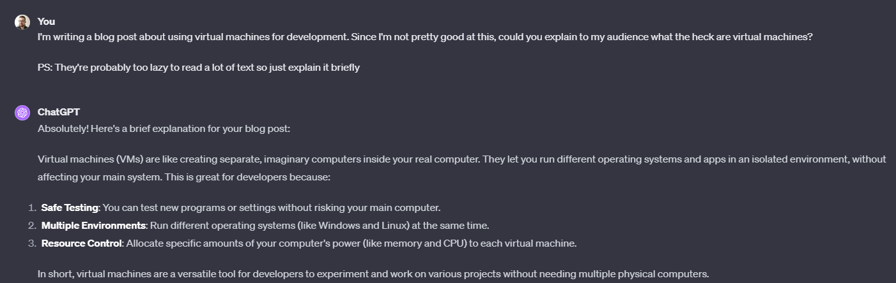
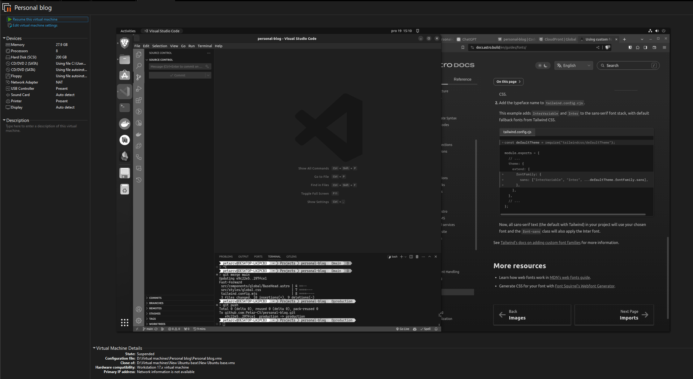

If there's any piece of software that changed my workflow for the better, it has to be VMWare Workstation Pro. Even though I'm not affiliated in any way, I simply had to describe how I use this tool to manage multiple dev environments and how it enables me to practically instantly switch from one project to another.

### The problem at hand

If at any point in your career, you had the _"pleasure"_ of working on multiple projects, chances are you've stumbled across some projects that require you to use different versions of tools such as _node_ or even different git accounts. Another thing I see a lot of my colleagues have to deal with is installing various programs such as VPNs and other software that enable them to perform the task at hand.

Did you ever get tired of cleaning up bloat on your operating system so you simply reinstalled it, only to find out you'll be reinstalling a lot of those packages for the next couple of hours?

### Enter the world of virtual machines

So what are these exactly? Let's ask our friend _ChatGPT_.

Ok, that makes sense. Let's start with the things that make VMs an ideal solution for me as a developer.

### How I use VMWare Workstation Pro

To keep things simple, I mostly use **Ubuntu** for software development. Why? For me, it feels much faster than Windows, and generally, in my experience as a web developer, a lot of things are easier to set up on Linux as opposed to Windows.

Basically, what I have is a base Ubuntu image I've named "Ubuntu base". On that image, I performed a setup of the most common tools I use day to day. These include VS Code, Git, Android Studio, browsers, etc. From time to time I update this base image simply by running it and installing updates or changing some of the tools.

Since Workstation Pro has a nifty feature that enables us to clone virtual machines, I'm able to simply create a new clone whenever I want to work on a new project. To be precise, both deep cloning and linked cloning are supported. Deep cloning is useful when you want to transfer your virtual machine to another device without the _base virtual machine_ while _linked_ clones come in handy for day-to-day tasks since they take much less space on your drive.

So what's the feature I cannot live without? Believe it or not, it's the ability to pause a virtual machine, essentially putting it into _sleep_ mode. This feature was a game-changer for me. When I'm working on a project, I like to open a lot of documents, browser tabs, etc. If I need to quickly switch to another project, I don't want to lose these open sessions. Moreover, I don't want to _think_ about not closing them, if that makes sense. I just _want it to work_.
Picture this; you're working on Project A and suddenly, your colleague asks you about the thing you did on Project B a couple of weeks ago. If you were in this situation, your response was probably something along the lines of "Give me some time to find out where I left off". For me, this problem requires me to simply _resume_ my virtual machine. This usually takes a couple of seconds. After the VM resumes, I'm greeted with all my browser and IDE sessions as if I were working on that project a couple of minutes ago.

Now, for me, that's invaluable.

Another side effect of using VMs is the reduced bloat on your main machine. I'm sure you were in a position in which you were forced to install some tools you were going to use only once. I hate that feeling. When using VMs, you can have one _trash_ VM in which you'll run these one-time programs. After that, you can simply delete the VM, and voila, the bloat is gone.

Portability is another cool feature you get with this workflow since you can easily move these virtual machines between devices. Just keep in mind you should set passwords on your VMs in case someone tries to steal them.

There's a lot more to this workflow, but, generally, these features don't affect my workflow as much as the ones I mentioned.
For example, security is pretty good when using VMs. If you're following some basic recommendations about stuff such as shared folders and clipboards, you'll be fine catching a virus and simply deleting a whole VM to clean it. That is if you don't have any sensitive information on the VM itself.

#### Cons

One of the biggest problems when working with virtual machines is the performance overhead they have.

More specifically, you need to have a pretty solid PC to run both the host OS and the _guest_ OS. For example, I started with this workflow when I had a laptop with 8 CPU cores and 16 GB of RAM and the performance wasn't great. I quickly installed one more 16 GB RAM stick and started to run Ubuntu virtual machines that were given 4 CPU cores and 20 GB of RAM. Now, that was something else. Everything was really snappy and the performance was great. From then on, I've moved to a desktop PC with 64 GB of RAM and 16-core CPU on which I'm able to run 2-3 virtual machines at once without sacrificing a lot of performance, even when running Dockerized applications.

Continuing on the overhead problem is the disk space issue. Every time I _link clone_ a virtual machine, I instantly "lose" about 40 GBs of space just for that virtual machine. On top of that, you have to keep in mind that that's not the maximum size of your virtual machine. For example, my machines have a size limit of about 200 GBs which means they can grow up to that size. This, in the end, means that I must have that amount of storage available to the VM that's being used.

If you're mostly using link-cloning, you should be aware that your _base_ image grows each time you perform a change to it and then clone it. Essentially, whenever you create a link-cloned VM based on your _base_ image, the base image creates a _snapshot_ of its current state. This snapshot is used as a base layer for your linked VM. Keep in mind that from time to time, you should clean unused snapshots as well.
From my experience, I started with 1 TB of SSD on my laptop on which I could have about 5-6 VMs at each point. This was pretty fine for me. My current desktop has about 4 TB of storage specifically for virtual machines, various projects, and mostly unsorted trash files. I'm nowhere near half of that disk space even after almost a year of daily usage. To be frank, I have some unused VMs as well.

Using a dedicated GPU simply doesn't work in your VMs. Now that's a dealbreaker for ML and AI enthusiasts for sure. I saw some workarounds, but none of them worked for my PC. I hope that'll change in the future, but I'm not counting on it any time soon.

Workstation Pro currently costs 199$ (base price) if you're a new user and 99$ if you're upgrading from a previous major release. There's also a free trial of 30 days. If that's good or not, you'll have to be the judge for yourself. For me, if I'm able to snatch it on some deal, it's a great price for a tool I can use for years without upgrading to another major version.

### Are there other solutions?

For using VMs, yes. There's a free tool from Oracle called [VirtualBox](https://www.virtualbox.org/). Personally, I've used it previously for my college stuff, but the performance wasn't great. Keep in mind that was about 3-4 years ago and a lot could've improved. So feel free to try it out.

If you're not into VMs, you can use [WSL](https://ubuntu.com/wsl) (Windows Subsystem for Linux). This tool is impressive as it enables you to run Ubuntu with very small overhead compared to classic VMs but without GUI. For what it's worth, here's an [official tutorial](https://learn.microsoft.com/en-us/windows/wsl/install) on how to set it up in case you're interested. For me, the issue with WSL is that a lot of the time, switching my IDE from one project to another is not the problem. The problem lies in those program sessions I talked about. More specifically, when you're writing code, you're not _just writing code_; you're reading articles, researching your problems, reading docs, and tons of other things. For me, these _other_ things need to be easily accessible based on the project I'm working on, and for that use case, VMs are practically irreplaceable.

### Conclusion

VMWare Workstation Pro has been an essential tool for me. Resuming virtual machines, not having to deal with bloatware on my main OS, and simply enjoying Ubuntu (which I can't daily drive since I like to play video games) are all the things that work exceptionally well using this VM workflow. I hope you'll give it a try 🙂

If you have any questions or want to make fun of this workflow, let's get in touch.

As usual, happy coding! 🐛
